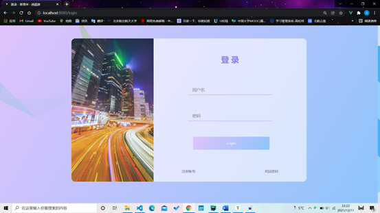
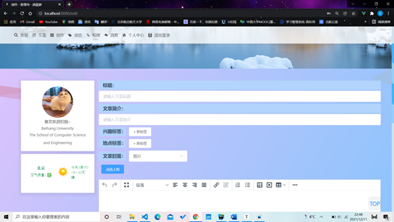
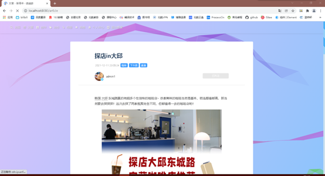
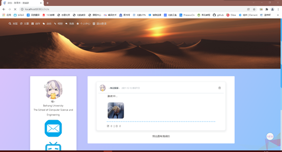
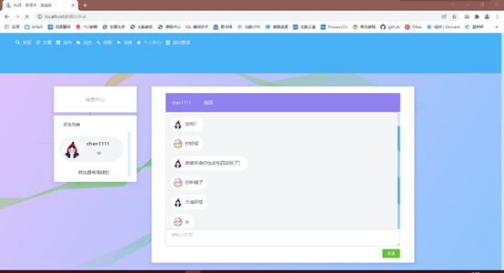
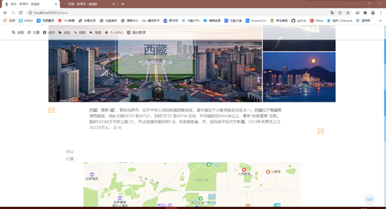

## One web design example

BUAA数据库大作业二前端部分 v4.0.0

### Usage

##### 安装项目依赖

```
npm install
```

##### 启动项目

```
npm run serve
```

### Display

/:                  

/login:					

/space:			  	

/edit:					 

/article:				

/circle:				  

/album:			 

/chat:				

/place:			

/place_select:

### Notice

个人部分

TinyMCE：vue结合富文本的资料虽然很多，但实用性和时效性不高，大部分都跑不起来，如果需要嵌入富文本编辑可以参考edit.vue部分；

Amap：最初用的webAPI接口，很顺畅，但因为渲染出来的是静态地图被否了；在使用jsAPI时遇到了很多问题，vue中AMAP的同步加载在尝试中未能成功，故搜索大量资料后采用了异步加载，误打误撞降低了运行时间和内存占用。注意：由于AMAP执行的是dom操作，故有加载AMAP的地方都要重刷一次页面。

### Log

12-20 v4.0.0

完成~
